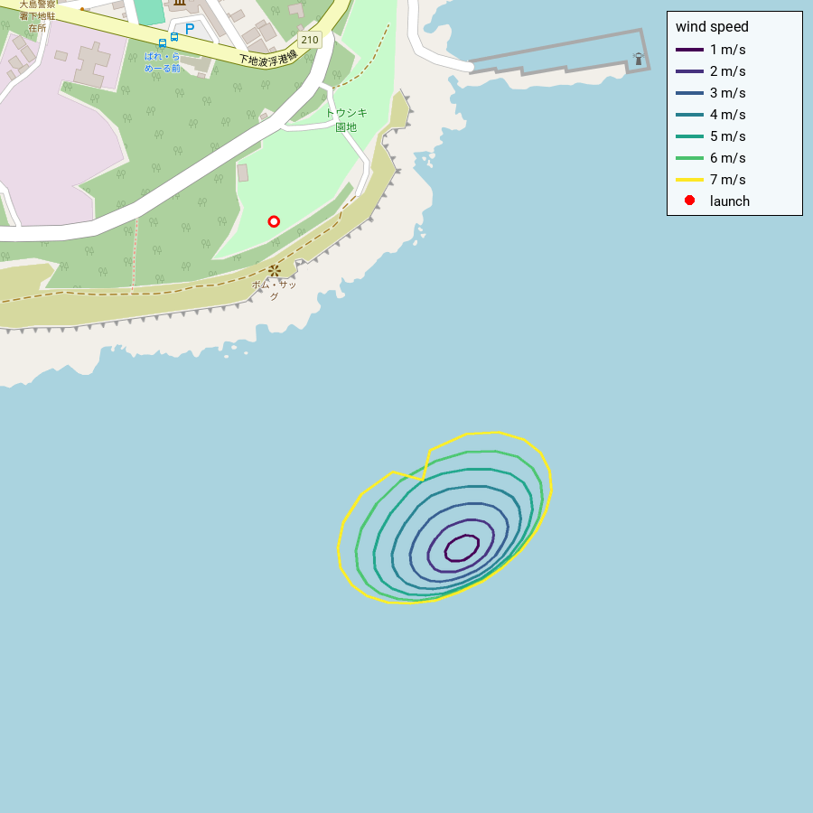

# Trochia

[](https://github.com/sksat/trochia/actions)
[](https://github.com/sksat/trochia/releases)
[](https://github.com/sksat/trochia/issues)
[](./LICENSE)

## trochia: trajectory of rocket and ground-hit-point calculator

Trochia is a rocket flight simulator written by modern C++.


## Install

There are pre-built binaries of latest release for some platform.

- [Linux](https://github.com/sksat/trochia/releases/latest/download/trochia-linux.zip)
- [Mac OS](https://github.com/sksat/trochia/releases/latest/download/trochia-mac.zip)
- [Windows](https://github.com/sksat/trochia/releases/latest/download/trochia-windows.zip)

Please see [Release Page](https://github.com/sksat/trochia/releases) for details.

### Build from Source

```sh
$ git clone https://github.com/sksat/trochia && cd trochia
$ mkdir build && cd build
$ cmake ..
$ make
```

## Usage

Trochia is run from the command line.
Please open your terminal and go to your project directory.

```sh
$ vim config.toml # write configuration by TOML
$ trochia
```

## Examples

Runnable use cases live in [`examples/`](examples/) (one directory each, with
config, a plotting script and a committed result plot). For example, the
[landing-dispersion](examples/landing-dispersion/) example sweeps wind speed ×
direction and plots the ground-hit points — here overlaid on the launch site
(Izu Oshima), with the launcher tilted downrange so the whole dispersion falls
offshore, clear of land:



The [validation-estes-viking](examples/validation-estes-viking/) example checks
trochia against a real measured flight: its predicted apogee lands within ~1 % of
the altimeter reading (39.1 m vs 39 m). The
[psas-launch12](examples/psas-launch12/) example scales that up to a real ~5 km
high-power flight (validated apogee) and computes the contingency landing zones —
nominal recovery vs parachute failure vs CATO. The
[astra](examples/astra/) example validates a real ~3.25 km flight on **both** the
ascent and the descent (its recovery failed, so the measured fall is near
ballistic — exactly what trochia can check) and lays out the hazard zone
(警戒区域) and abort (途中破談) footprints.

## Python tooling (uv)

The simulator is C++, but a few helper scripts are written in Python. Their
dependencies are managed with [uv](https://docs.astral.sh/uv/) (pinned in
`pyproject.toml` / `uv.lock`).

```sh
$ uv sync                                  # create .venv from the lockfile
$ uv run convert-ghp.py output/85/ghp.csv  # ground-hit-point -> lat/lon for view-ghp.html
```

`convert-ghp.py` converts the simulator's `ghp.csv` output into geographic
coordinates (writing `ghp-output.js`) so the landing dispersion can be overlaid
on the map in `view-ghp.html`.

## Author

GitHub: [sksat](https://github.com/sksat)

Twitter: [@sksat\_tty](https://twitter.com/sksat_tty)

## License

See [LICENSE](./LICENSE)
