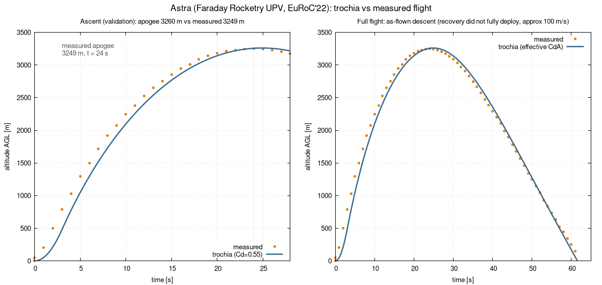
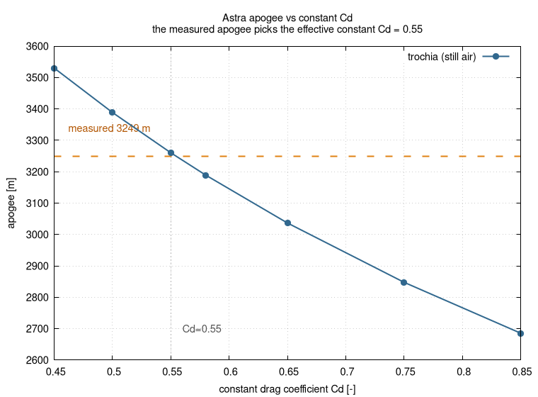
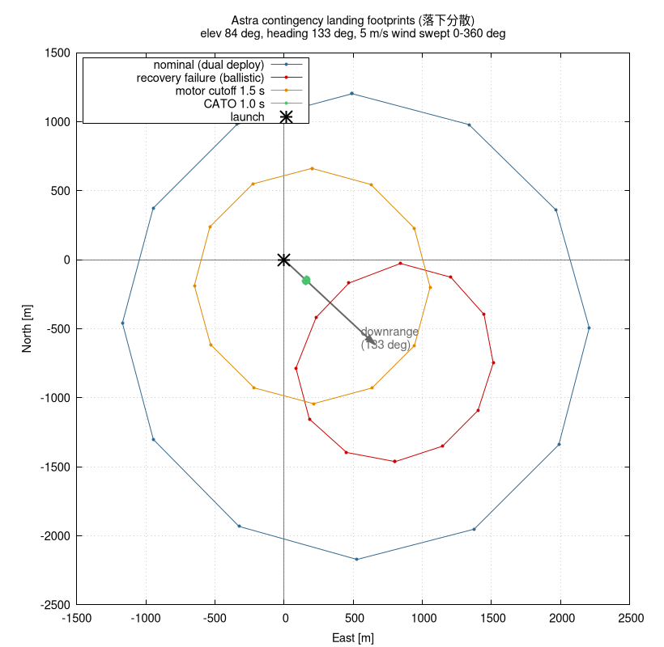
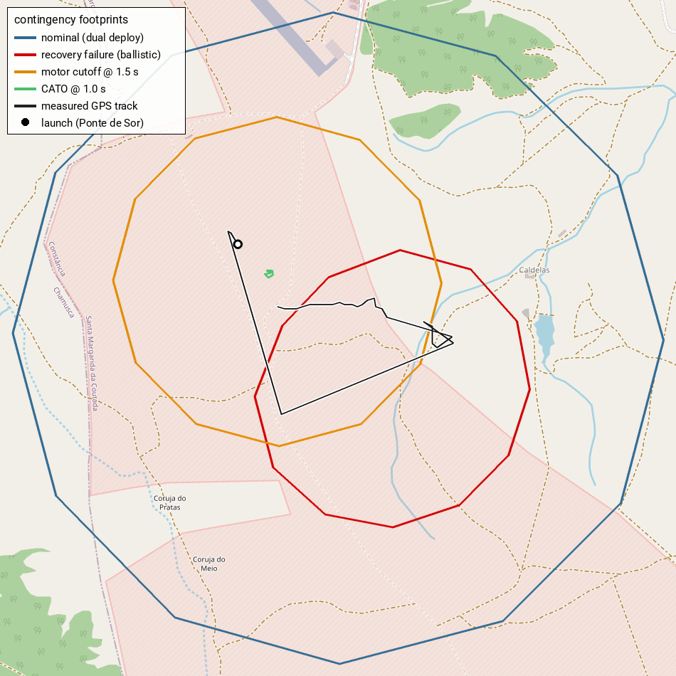

# Astra — km-scale real-flight validation (ascent **and** descent) + hazard zone & abort

**Use case:** a real, instrumented flight (~3.25 km apogee) used to (a) validate
trochia against measured data on **both** the ascent and the descent, and
(b) compute the hazard area / landing dispersion (警戒区域 / 落下分散) and the
abort (途中破談) footprints — a full launch-safety analysis on a single rocket.

## The flight

**Astra**, built by **Faraday Rocketry UPV**, flown at **EuRoC 2022** (European
Rocketry Challenge, Ponte de Sor, Portugal) on a commercial **Cesaroni
4263L1350-P** solid motor. Measured apogee **3249 m at t ≈ 24 s**; the recovery
**did not deploy cleanly**, so the rocket came down close to ballistic
(~100 m/s) — which, conveniently, lets us validate trochia's *descent* leg
against real data, not just the apogee.

The rocket parameters, the measured trajectory (`measured.dat`,
`measured-track.dat`) and the drag curve all come from the RocketPy "Astra"
example:
- rocket model + measured flight data: <https://github.com/RocketPy-Team/RocketPy/tree/master/data/rockets/astra>
- worked example notebook: `docs/examples/astra_flight_sim.ipynb` in that repo
- motor: <https://www.thrustcurve.org/motors/Cesaroni/4263L1350-P/>

## Run

```sh
./run.sh         # fetch motor, run validation + hazard/abort sims, write the plots
```

`run.sh` needs the `trochia` binary at `build/bin/trochia` (build from the repo
root) and, for the map, network access + `uv`.

## Validation vs the measured flight

`config-validation.toml` reconstructs the actual flight in still air and is
plotted against the rocket's own measured altitude history:



| quantity | measured | trochia | 
|---|---|---|
| apogee | 3249 m | 3260 m (**+0.3 %**) |
| time to apogee | ~24 s | 25.0 s |
| descent speed (near ground) | ~100 m/s | ~108 m/s |

- **Ascent (left)** is the validation: with a single representative drag
  coefficient the whole climb and the apogee match within a fraction of a
  percent.
- **Descent (right)** is the part that's usually *not* checkable. Because Astra's
  recovery only partially deployed, the measured descent is close to ballistic
  and trochia reproduces it to within ~70 m down to ~145 m AGL, where the
  measured record ends (see *recovery modelling* below).

### Why a constant Cd works here

trochia uses a single constant drag coefficient, but Astra's real drag varies
with Mach (subsonic ~0.58, a transonic peak of 0.857 near Mach 0.89, which the
rocket reaches around burnout). Sweeping the constant Cd in still air shows the
measured apogee selects an **effective constant Cd ≈ 0.55** — the constant that
reproduces the measured apogee, i.e. the transonic drag rise folded into one
number (not the arithmetic mean of the Cd–Mach curve):



## Hazard zone (落下分散) + abort (途中破談)

`config.toml` flies the validated ascent model under a wind-direction sweep
(5 m/s, 0–360°) for four contingency branches, giving one landing footprint
each:

| scenario | meaning | recovery |
|---|---|---|
| `nominal` | intended flight | dual deploy (drogue at apogee + main at 450 m AGL) |
| `recovery-failure` | total recovery failure | none → ballistic (worst-case impact) |
| `motor-cutoff` | thrust quits mid-burn (t = 1.5 s) | airframe intact, recovers |
| `cato` | structural failure (t = 1.0 s) | thrust stops + no recovery |



On the real launch site (the measured GPS track, up to where its record ends at
~145 m AGL, is drawn for reference):



The launch is tilted (84° elevation, 133° heading), so every footprint is biased
**downrange toward 133°**. Reading the safety story off the plot:

- **dual deploy** drifts the *most* — it spends minutes under canopy, so wind
  exposure dominates and the zone is the widest, though the landing is gentle;
- **recovery failure** (no recovery at all) is a tight, downrange *lawn-dart* —
  it falls too fast to drift much, but hits hard. The real flight's partial
  recovery (~100 m/s) was a milder version of this; a clean total failure would
  be faster and tighter still;
- **motor cutoff** stays closer in (lower apogee, still recovers);
- **CATO** debris stays right by the pad.

## Modelling notes / caveats

- **Representative Cd.** 0.55 is the effective constant that reproduces the
  measured apogee; trochia cannot reproduce the *timing* of the transonic drag
  rise, only its net effect on apogee (which is what `cd-sensitivity.png`
  calibrates).
- **CATO is single-body.** trochia models the `cato` branch as one intact body
  with thrust cut and no recovery, not a fragmenting debris cloud; read its
  footprint as "where the (single) vehicle comes down", not a debris dispersion.
- **Recovery modelling.** Astra's recovery hardware drag is not published. The
  validation run models the as-flown partial recovery as an *effective* drag
  `cd·area ≈ 0.015 m²` calibrated to the measured descent; `recovery-failure`
  in the hazard analysis is a stricter, fully ballistic fall (faster still).
- **Mass / motor.** trochia's `mass` is the airframe **without** the loaded
  motor (9.10 kg); the motor (loaded 3.57 kg, 2.02 kg propellant) comes from the
  `.eng`, giving a 12.67 kg liftoff mass that matches the RocketPy model.
- **CG / CP / inertia / Cna** are estimated from the RocketPy geometry and are
  second-order for these (apogee- and descent-dominated) results.
