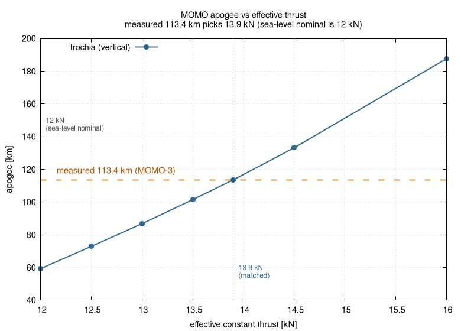
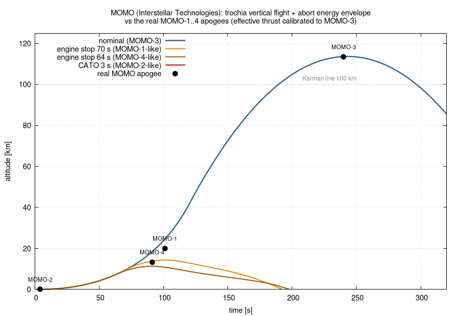
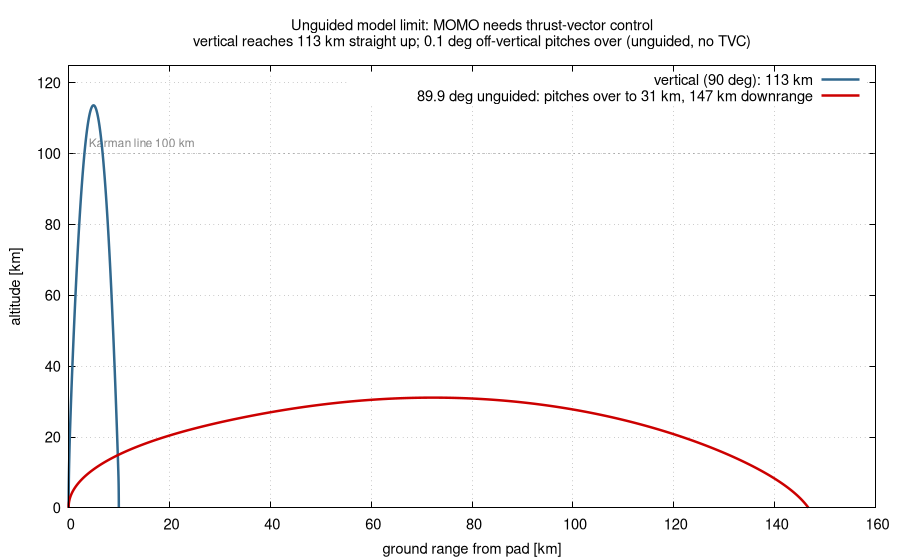

# MOMO — sounding-rocket apogee validation + abort energy envelope (and an unguided model's limit)

**Use case:** a real space-reaching sounding rocket (~113 km) used to (a) work out
what it takes to reproduce the 113 km apogee — an **effective-thrust calibration**
(the published *sea-level* numbers under-predict, though they turn out to be
self-consistent once altitude thrust gain is accounted for), (b) **cross-validate**
the *abort energy envelope* and the dry mass against the real MOMO-1/2/4 flights,
and (c) demonstrate — honestly — **where an unguided point-mass model stops being
valid** for an actively-guided rocket. The headline apogee match is calibrated,
not predicted; see section 1.

This is the first example that exercises the high-altitude
[USSA1976 atmosphere](../../src/environment/air.hpp): the old troposphere-only
air model went NaN above ~44 km and could not run this flight at all.

## The flight

**MOMO**, by **Interstellar Technologies (インターステラテクノロジズ)**, launched
from the Hokkaido Spaceport / IST Taiki launch site (Taiki-cho, Hokkaido,
~42.475 °N, 143.376 °E). **MOMO-3** (2019-05-04) was the first Japanese
privately-developed rocket to reach space, apogee **113.4 km**. It is
single-stage, ethanol/LOX, pressure-fed, and — crucially for this example —
**actively guided** (gimbaled thrust-vector control + RCS).

Reference vehicle = MOMO-3 (v0): 9.9 m long, 0.5 m diameter, 1150 kg liftoff
(330 kg dry + 820 kg propellant), ~12 kN sea-level thrust, ~120 s burn. The real
flight outcomes used for validation:

| flight | date | outcome | apogee |
|---|---|---|---|
| MOMO-1 | 2017-07-30 | aerodynamic break-up ~70 s | ~20 km (unofficial) |
| MOMO-2 | 2018-06-30 | CATO ~3 s, fell on the pad | ~0 |
| MOMO-3 | 2019-05-04 | **success** | **113.4 km** |
| MOMO-4 | 2019-07-27 | engine auto-stop 64 s | ~13.3 km |

(Parameters were compiled and cross-checked from IST material, JA/EN Wikipedia
and Gunter's Space Page; several figures are estimates — see *caveats*.)

## Run

```sh
./run.sh        # vertical flight + abort envelope, the tilt demo, the thrust sweep, plots
```

## 1. Effective-thrust calibration (the apogee is the *input* here, not a prediction)

> **Read this first:** the nominal 113 km apogee is **calibrated**, not derived.
> The published spec does *not* by itself produce 113 km — the effective thrust
> was tuned to match the measured apogee. The genuinely *predictive* checks are
> in [section 2](#2-what-is-actually-validated).

Launched dead-vertical in still air with the *literal* published numbers
(12 kN × 120 s, 1150→330 kg), trochia reaches only **59 km** — with a liftoff
thrust-to-weight of just **~1.06**, ~120 s of burn loses most of the ideal Δv to
gravity. Sweeping the effective constant thrust, the measured apogee picks out
**~13.9 kN** (so the rocket reaches 113.6 km at t = 243 s, by construction):





### Why the literal 12 kN under-predicts — and why the spec is *not* inconsistent

Held constant, 12 kN × 120 s over 820 kg implies an effective Isp of only ~179 s,
which looks too low for ethanol/LOX — but **12 kN is the *sea-level* thrust**, and
MOMO is pressure-fed, so its thrust rises as ambient pressure drops. Over this
burn the time-averaged ambient pressure is ~47 % of sea level, so reconciling
`F(0) = 12 kN` with a flight-average of 13.9 kN implies:

| quantity | value | note |
|---|---|---|
| nozzle exit diameter | ~211 mm | vs 500 mm body — plausible |
| vacuum thrust | ~15.6 kN | +30 % SL→vac (normal for low-chamber-pressure pressure-fed) |
| effective Isp (flight avg) | ~207 s | **in the ethanol/LOX range** |
| vacuum Isp | ~232 s | — |

So the published numbers are **self-consistent**; the apparent ~179 s shortfall is
purely the artifact of holding the sea-level thrust constant. The 13.9 kN
**trajectory-matched effective thrust** is the flight-average of that
altitude-varying thrust (and brackets the v1 engine's 14 kN upgrade). But there
is no published vacuum-thrust / nozzle figure to fix the thrust *a priori*, so the
apogee remains calibrated, not independently derived.

## 2. What *is* actually validated

The model is calibrated on MOMO-3's apogee (section 1). Three things then come
out of that calibrated model **without further tuning** — this is the real
validation content:

**(a) Abort energy envelope — a cross-flight prediction (途中破談).** With the
thrust fixed by MOMO-3, stopping the engine at time T predicts how high *other*
flights coast before falling back, and these land in the same energy ballpark as
the real MOMO failures (the abort curves in `altitude.png`):

| scenario (vertical) | trochia max alt | real flight |
|---|---|---|
| CATO @ 3 s | 0.0 km (pad) | MOMO-2 ~0 ✓ |
| engine stop @ 64 s | 11.3 km | MOMO-4 ~13.3 km |
| engine stop @ 70 s | 14.3 km | MOMO-1 ~20 km (unofficial) |
| nominal (full burn) | 113.6 km | MOMO-3 113.4 km (calibrated) |

This is an *energy* sanity check (abort time → peak altitude), **not** an accident
reconstruction: MOMO-1 was an aerodynamic break-up and MOMO-2 a pad-fall; here
they are modelled simply as the thrust stopping at that time. The two in-flight
failures land within a few km of the real (and partly unofficial) apogees — the
right scale, not an exact match.

**(b) Dry mass.** With Gunter's ~700 kg dry mass, *no* plausible thrust reaches
113 km — an independent reason to prefer the ~330 kg figure (which the research
also favours on a mass-fraction basis).

**(c) Time-to-apogee.** Calibrating the thrust to the apogee *altitude* leaves
the apogee *time* free; it comes out 243 s vs the measured ~240 s — a weak but
non-circular corroboration.

## 3. The limit of an unguided model (why MOMO needs TVC)

trochia is **unguided**; MOMO flies on active thrust-vector control. With
T/W ~ 1.06 the rocket leaves the rail at only a few m/s, so the slightest
off-vertical angle is never corrected and the vehicle weathercocks far over
instead of flying MOMO's near-vertical guided ascent:



Vertical → 113 km straight up; **0.1° off-vertical** → pitches over to a ~30 km
apogee and then impacts ~150 km downrange. The exact numbers are illustrative
(trochia's rotational damping uses a hardcoded constant not tuned to this
vehicle); the point is qualitative — this is *not* a MOMO trajectory but the
unguided model showing its own validity boundary, which is exactly why a real
sounding rocket of this class needs active guidance.

## Modelling notes / caveats

- **Vertical only.** Because the unguided model diverges for any tilt, only the
  vertical energy/altitude problem is faithful. A horizontal **hazard zone /
  落下分散 is deliberately *not* produced** — for a guided vehicle it would be the
  runaway dispersion of a fictional unguided rocket, not a meaningful safety
  envelope. The real MOMO-3 splashed ~37 km ESE under guidance; reproducing that
  needs a TVC/guidance model trochia does not have.
- **Effective thrust 13.9 kN** is calibrated to the measured apogee (see above),
  not the 12 kN sea-level nominal.
- **Constant Cd = 0.45** referenced to the body cross-section; apogee is
  insensitive to it (drag is negligible above ~50 km).
- **Mass model:** config `mass` = 330 kg airframe (incl. empty tankage); the
  820 kg propellant comes from the `.eng`, giving 1150 kg liftoff.
- **Atmosphere:** uses the USSA1976 model to 113 km; the previous
  troposphere-only model went NaN above ~44 km and could not run this case.
- **Known robustness limit:** an unguided, low-T/W flight with *wind* can tumble
  hard enough to drive the integrator to NaN (the sim aborts instead of
  terminating gracefully). The vertical cases here avoid it; this is tracked
  separately and is why the windy/tilted regime is kept out of the main run.
