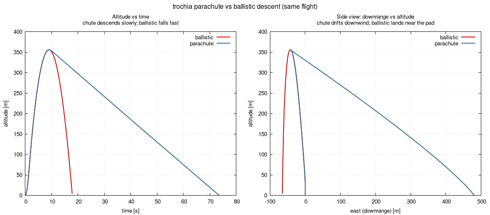
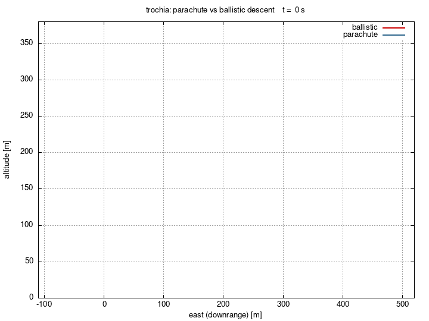

# Parachute vs ballistic descent

**Use case:** show what the parachute model (issue #6) changes — the same flight
recovered under a parachute versus descending ballistically (a recovery failure).
The only difference between the two configs is whether a chute deploys at apogee.

Same rocket (LARKSPUR-XP.300), 4 m/s east wind.

## Run

```sh
./run.sh        # runs both configs -> out-chute/, out-ballistic/, writes comparison.png
```

(equivalently: `../../build/bin/trochia config.toml` and
`../../build/bin/trochia config-ballistic.toml`, then `gnuplot plot.gp`.)

## Result

Both reach the same ~355 m apogee, then diverge completely:

- **ballistic** falls in ~8 s and lands ~65 m **upwind** (the rocket
  weathercocked into the wind on the way up, so its arc leans upwind).
- **parachute** descends for ~64 s at its terminal velocity and drifts ~480 m
  **downwind**.

Recovery moves the landing point by ~550 m here — which is exactly why a
realistic landing-zone calculation needs the parachute model rather than a
ballistic descent.



The timing differs too — the ballistic case is down in ~18 s while the parachute
case is still aloft at ~73 s — which the animation makes obvious:


