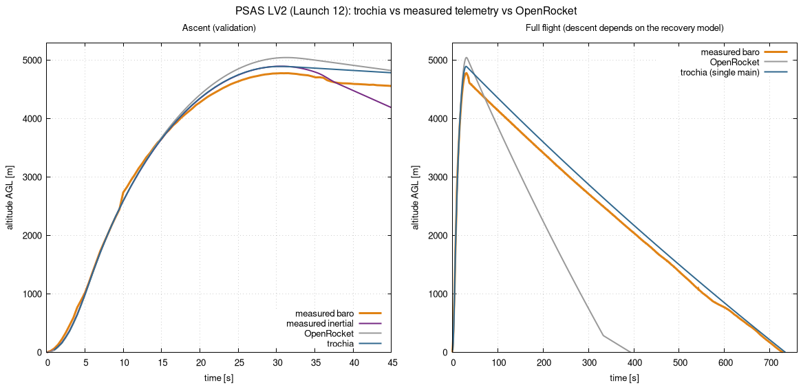
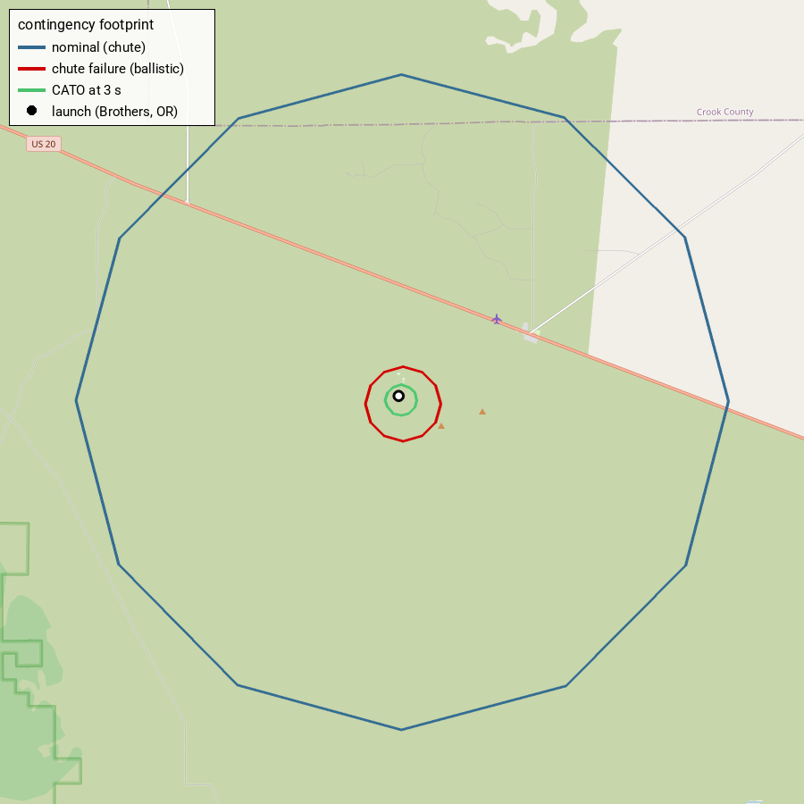
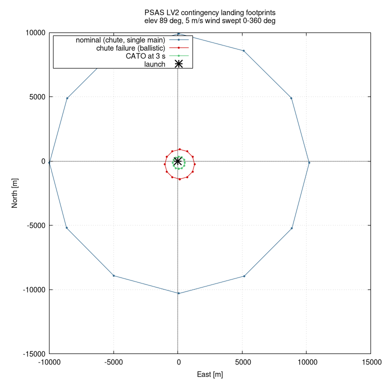
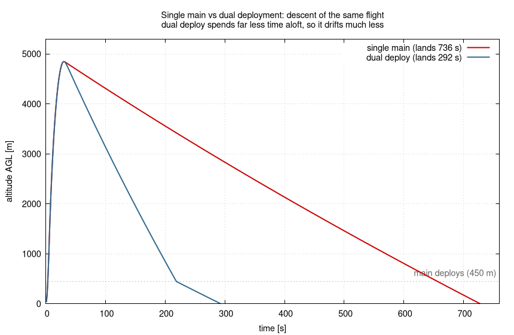
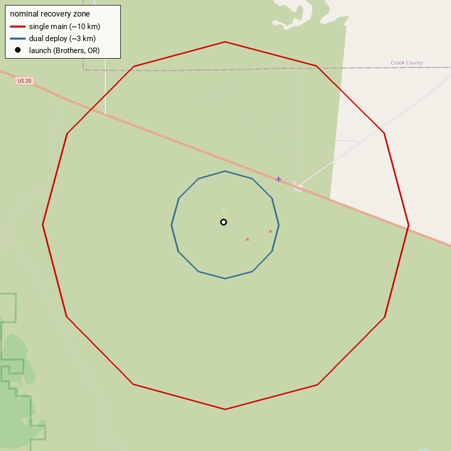

# PSAS Launch-12 — km-scale validation + contingency landing zones

**Use case:** a real high-power flight (~5 km apogee) used to (a) check trochia's
accuracy against a measured flight and (b) compute the landing zones for several
contingency scenarios — the core of a launch-safety analysis.

## The flight

Portland State Aerospace Society **"Launch 12"** (LV2 airframe) on a **Cesaroni
N2501**, flown 2015-07-19 at Brothers, Oregon. Open data + OpenRocket model:
- flight data: <https://github.com/psas/Launch-12>
- geometry/mass (.ork): <https://github.com/open-aerospace/LV2.2>
- motor: <https://www.thrustcurve.org/motors/Cesaroni/15227N2501-P/>

Measured apogee **4781 m** (TeleMetrum baro) / **~4900 m** (GPS+IMU, "most
correct" per PSAS); the project's OpenRocket run gives 5046 m.

## Run

```sh
./run.sh         # fetch motor, run all scenarios x wind dirs, write the plots
```

## Validation vs the measured flight

trochia's altitude is plotted against the rocket's own **measured telemetry** and
OpenRocket. All curves are downsampled from the PSAS data (`measured-*.dat`,
`openrocket.dat`):

- `measured-telemetrum.dat` — barometric altimeter, full flight to landing
- `measured-inertial.dat` — IMU/inertial altitude (reliable on the ascent;
  inertial integration drifts afterwards)
- `openrocket.dat` — the project's OpenRocket simulation



**Ascent (left)** is the validation: all four agree the whole way up. Apogee:

| source | apogee |
|---|---|
| measured (baro) | 4781 m |
| measured (inertial / GPS+IMU) | ~4900 m |
| OpenRocket | 5046 m |
| **trochia** | **~4894 m** |

trochia sits on the inertial measurement; the barometric curve reads a little low
(as PSAS noted) and OpenRocket is a bit high.

**Full flight (right)** shows the descent. trochia's chute diameter is
*calibrated* to the measured descent (PSAS's canopy size is unpublished), so its
single-main descent tracks the baro curve down to ~740 s. OpenRocket models a
faster recovery (~394 s). The real profile descends a little faster than a single
main near apogee (a likely drogue phase), but the overall rate and landing time
match.

## Contingency landing zones

The same flight is run under three [scenarios](../../config-example.toml) and the
wind direction is swept 0–360° (at 5 m/s), giving one landing footprint each —
overlaid on the real launch site (Brothers, Oregon):



The nominal recovery footprint reaches across US-20 and the county line — the kind
of thing a range-safety review exists to catch. The same zones in plain
East-North metres:



| scenario | what fails | zone radius from the pad |
|---|---|---|
| nominal | nothing (chute deploys) | **~10 km** |
| chute-failure | parachute does not deploy → ballistic | ~1.4 km |
| CATO at 3 s | structural failure → no thrust, no recovery | ~0.6 km |

The key safety insight: the **nominal recovery zone is the largest** — descending
under the main for ~12 minutes, the rocket drifts ~10 km downwind, far beyond
where a ballistic failure would land. A range-safety area has to contain all of
these.

These footprints are trochia's *predictions* — they are **not** overlaid with the
real landing point because the flight's onboard GPS position froze a few seconds
after launch (it stuck near the pad; only altitude, not horizontal position, was
recovered). So there is no measured landing coordinate to compare against; the
ascent altitude above is the part the telemetry can validate.

## Dual deployment shrinks the recovery zone

A single main from ~5 km drifts ~10 km — across US-20. The standard fix is **dual
deployment**: a small drogue at apogee (fast descent) and the main only at low
altitude. `config-dualdeploy.toml` models this (drogue + main at 450 m AGL).

The mechanism is clearest in the descent: under the drogue the dual-deploy flight
comes down ~2.5x faster, only slowing under the main near the ground, so it is
aloft for far less time (292 s vs 736 s):



Less time aloft means less wind drift, so the nominal landing zone shrinks from
~10 km to ~3 km and stays local:



This is exactly why high-power rockets use dual deployment; `parachute` takes any
number of stages (see the repo `config-example.toml`).

## Caveats (what is estimated)

- **Drag**: trochia uses a *constant* Cd, but this flight is transonic (~Mach
  1.1) where drag rises sharply. Sweeping Cd 0.40–0.60 gives apogee 6012→4975 m;
  Cd = 0.60 was chosen as the transonic-average that matches the measurement and
  OpenRocket. So unlike the low-speed Estes-Viking case, the apogee here *does*
  depend on the drag model.
- **CG / CP / Cna / inertia**: from the OpenRocket/JSBSim model or estimated.
- **Recovery**: the nominal run uses a single main calibrated to the measured
  descent (PSAS's canopy size is unpublished). trochia does support multi-stage
  recovery (the dual-deployment section above); the nominal stays single-main
  because that matches the measured slow descent, so its ~10 km zone is the
  single-main worst case.
