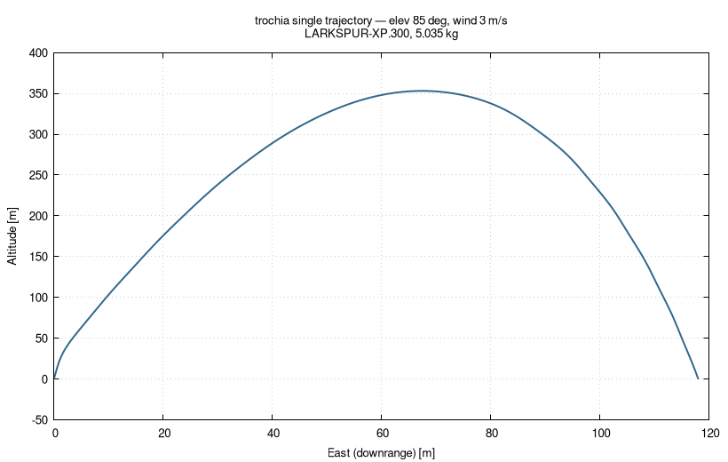

# Single trajectory (one launch condition)

**Use case:** compute a single trajectory for one launch condition — apogee,
downrange and the ground-hit point of one flight.

Elevation 85 deg, ground wind 3 m/s from -90 deg, LARKSPUR-XP.300 motor, 5.035 kg.

## Run

```sh
../fetch-engine.sh            # once: downloads ../20191020_01.eng
../../build/bin/trochia        # reads ./config.toml -> output/85/3/-90/*.dat
gnuplot plot.gp                # -> trajectory.png
```

## Result

Apogee ~353 m at ~67 m downrange; ground-hit point (E 118, N -102) m. A clean,
stable arch (no tumble).


