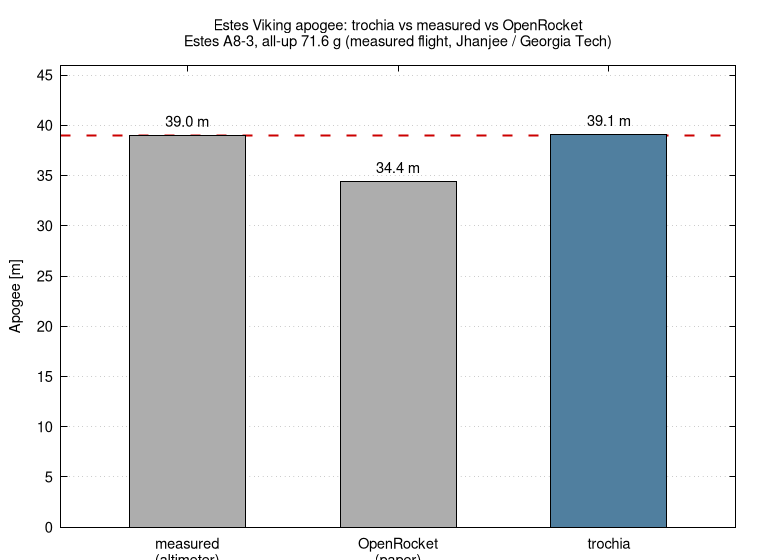

# Validation: Estes Viking (vs a measured flight)

**Use case:** estimate trochia's own accuracy by reproducing a real, published
model-rocket flight and comparing the predicted apogee to the **measured** one.

## The flight

A modified Estes Viking flown on an **Estes A8-3** motor (all-up mass 71.6 g),
from Daksh Jhanjee, *"Design Modification and Flight Performance Analysis of the
Estes Viking Model Rocket"* (Georgia Institute of Technology,
[ResearchGate 398838878](https://www.researchgate.net/publication/398838878_Design_Modification_and_Flight_Performance_Analysis_of_the_Estes_Viking_Model_Rocket)).

- **Measured apogee: 39 m** (PerfectFlite Pnut barometric altimeter)
- Paper's OpenRocket prediction: 34.4 m; max velocity 25.4 m/s; time-to-apogee 2.9 s

## Run

```sh
./fetch-engine.sh            # downloads A8.eng from ThrustCurve.org
../../build/bin/trochia        # reads ./config.toml, prints "max altitude"
gnuplot plot.gp              # -> apogee-comparison.png
```

## Result

| quantity | measured | OpenRocket (paper) | **trochia** |
|---|---|---|---|
| apogee | 39 m | 34.4 m (−11.8%) | **39.1 m (+0.2%)** |
| max velocity | — | 25.4 m/s | 26.1 m/s |
| time to apogee | — | 2.9 s | 3.1 s |

trochia reproduces the measured apogee to within ~1%, and on this flight is
closer to the measurement than the paper's OpenRocket run.



## How trustworthy is this?

The apogee here is set by motor impulse, mass and drag, so it is **robust to the
inputs that had to be estimated**:

- **Drag**: sweeping `Cd` over 0.40–0.75 moves the apogee only 39.4 → 38.3 m
  (the flight is slow, ~26 m/s, so dynamic pressure is low). The result does not
  depend on guessing `Cd` well.
- **CG / CP / Cna / inertia**: estimated (see `config.toml`), but at a
  near-vertical, calm launch they affect weathercocking and stability, not the
  apogee.

Directly-sourced inputs: motor (Estes A8, ThrustCurve.org), all-up mass (71.6 g),
body diameter and length (kit spec). Estimated inputs: CG, CP, Cna, inertia.

Caveats: a single barometric-altimeter flight (the measurement has its own
uncertainty), and the flown rocket was a *modified* Viking, so its exact fin/nose
geometry (which we do not need for apogee) is approximated. This is one data
point, not a full validation campaign — but it shows trochia's trajectory
integration and atmosphere/drag model give a realistic apogee for a real motor.
